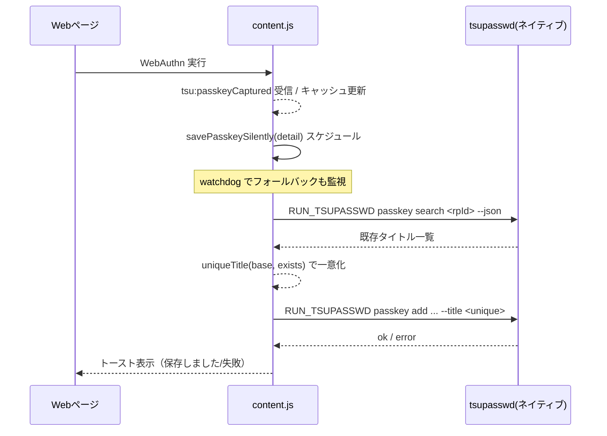

# auto-io-tsupasswd (MV3)

ネイティブアプリ（tsupasswd）から資格情報を取得し、Webページのフォームに入力するChrome拡張（Manifest V3）。

## 構成
- `manifest.json`: MV3マニフェスト
- `background.js`: Service Worker（イベント処理）
- `content.js`: ページに挿入されるスクリプト
- `popup/`:
  - `popup.html` / `popup.js` / `popup.css`
- `options/`:
  - `options.html` / `options.js`
- `.gitignore`

## ローカル読み込み手順
1. Chromeで `chrome://extensions/` を開く
2. 右上の「デベロッパーモード」をON
3. 「パッケージ化されていない拡張機能を読み込む」
4. このディレクトリ `auto-io-tsupasswd/` を選択

## 動作確認 / 使い方
- **自動実行/検出**: ページが `http/https/file` のとき、ロード後に資格情報を取得し、ユーザID/パスワード入力欄を深く探索して検出・バインドします（SPAにも追従）。
- **インラインポップの自動表示**: 入力欄検出後に1回だけ自動表示（アンカーが可視・実寸あり、直近ポインタ座標ありのとき）。以降はユーザID/パスワード入力のクリックで表示されます（フォーカスのみでは表示しません）。
- **表示対象の入力欄**: パスワード欄、または「同一フォームに可視のパスワード欄があるユーザID欄」で表示します。ユーザ名のみのステップは `account.jetbrains.com` など一部ホストで許可します。
- **候補クリックで入力**: 候補をクリック/タップすると、対応するフィールドへ値を入力し、ポップは即時に閉じます。片方しか無い場合は、その片方にだけ反映します。
- **ホバーでプレビュー**: マウスオーバーでプレビュー入力（マウス環境のみ）。
- **拡張ポップアップからの起動**: 拡張ポップアップからも検索・入力UIを使用できます。

## 仕様概要
- **資格情報取得/保存**:
  - 取得: `background.js` がネイティブホスト `dev.happyfactory.tsupasswd` に `{ args: [<url>, ...] }` を送信し、検索結果（`entries` または `username/password`）を受領。
  - 保存: `content.js` の保存ダイアログから `SAVE_TSUPASSWD` を送信。`background.js` が ネイティブホスト `dev.happyfactory.tsupasswd` に `{ action: 'SAVE', entry: { title, url, username, password, note } }` を渡します。パスワードは未入力でも保存可能（空文字として扱います）。
- **フィールド検出**:
  - 深い探索（Shadow DOM、iframe含む）
  - 近傍ペアリング（同一`form`優先→親近傍→距離スコア）
  - ユーザIDのみ／パスワードのみのフィールドにも対応
- **表示/入力**:
  - 固定配置のインラインポップを入力欄の `ownerDocument` に生成し、位置は対象フレームの `window` で追従
  - 初回自動表示（条件あり）＋クリック時表示。候補クリック/タッチ/ホバーで入力（片側のみでも反映）
- **SPA/URL変化対応**:
  - `pushState/replaceState/popstate/hashchange` をフックして、自動表示フラグをリセットし再表示可能に

## メッセージ/処理フロー（実装準拠）
- **メッセージ種別（`background.js`）**
  - `PING`
    - ヘルスチェック用。同期応答 `{ ok: true }`。
  - `RUN_TSUPASSWD`
    - ネイティブホストへ `{ args: [...], secret, bin? }` を送信。
    - 応答が `ok: true` の場合は `{ ok: true, data: <native response> }` を返却。
    - 失敗時は `{ ok: false, error, data? }` を返却（`stderr/stdout` 等を含むことあり）。
  - `SAVE_TSUPASSWD`
    - 保存用。`{ action: 'SAVE', entry: { title, url, username, password, note }, secret, bin? }` を送信。
  - `AUTH_TSUPASSWD`
    - 認証用。`{ action: 'AUTH', mode, secret, bin? }` を送信。`mode` 既定値は `secret`。

- **ホスト解決とフォールバック**
  - 優先順: `message.host` → `chrome.storage.local.host_name` → 既定値 → フォールバック群。
  - 現在の既定/フォールバックは `dev.happyfactory.tsupasswd`。
  - 複数候補に対して順次 `chrome.runtime.sendNativeMessage` を試行し、成功した時点で応答。

- **シークレット/バイナリパスの扱い**
  - `secret`: `message.secret` が無ければ `chrome.storage.local.auth_secret` を使用。
  - `bin`（任意）: `message.bin` が無ければ `chrome.storage.local.tsupasswd_bin` を使用。

## パスキー対応（WebAuthn/Passkey）

- **レガシーポップアップ抑止**
  - パスキー環境が有効な場合（`PublicKeyCredential` が利用可能、または内部フラグ・キャッシュが立っている場合）、ユーザID/パスワード/保存メニューのレガシーポップは表示しません。
  - `focusin`/`click`/`keydown` を含む全ての起点で同期ガードを入れ、レガシーポップの生成を早期 return で抑止します。

- **パスキー候補一覧の表示**
  - 明示的なユーザ操作時に、rpId を用いたパスキー候補一覧を表示します。
  - rpId の「部分一致（サブドメイン落としの suffix 走査）」も行い、`sub.example.com` で `example.com` のエントリも候補に含めます。
  - 候補クリック時は、サイトのログインボタンをスコアリングして自動クリック（登録/サインアップ系は減点して誤起動を低減）。見つからない場合はカスタムイベントでフォールバックします。

- **保存とタイトル一意化**
  - パスキー保存は `RUN_TSUPASSWD: passkey add <rpId> <cred> <user> <pub> [--sign-count N] [--transports CSV] [--title T]` を実行します。
  - 保存前に `passkey search <rpId> --json` で既存タイトルを取得し、重複時は `"タイトル (2)"`, `"タイトル (3)"` ... と連番を付与して一意化します。1000 を超える場合はタイムスタンプで一意化。
  - 自動保存（autosave）のウォッチドッグ・フォールバック経路でも同じ一意化ロジックを適用します。

- **自動保存（autosave）フロー**
  - ページ側ブリッジから `tsu:passkeyCaptured` を受信すると、キャッシュ反映後に `savePasskeySilently` を自動実行します。
  - まれな遅延に備え、ウォッチドッグがフォールバック保存を発動することがありますが、この経路でもタイトル一意化が行われます。
  - 保存成功時は「保存しました」トーストを表示します。

- **タイトル抽出の優先順**
  - アクティブ/近傍の入力からメール/電話らしい値を抽出。`amazon.co.jp` では電話番号を優先、それ以外ではメールを優先。
  - 取得できない場合はページタイトルなどにフォールバック。

- **デバッグヘルパの公開**
  - `window.tsupasswd.isPasskeyEnvOn()` / `window.tsupasswd.isPasskeyActiveNow()` / `window.tsupasswd.savePasskeySilently()` を公開。

### 図版（フローとシーケンス）

- **シーケンス図: パスキー自動保存と一意化**



- **フローチャート: レガシーポップ抑止と候補表示**

```mermaid
flowchart TD
  A[ユーザ操作: focus/click/keydown] --> B{パスキー環境?}
  B -- はい --> C[レガシーポップ抑止\n(早期 return)]
  C --> D[ユーザが明示操作した時だけ\nパスキー候補一覧を表示]
  D --> E{候補クリック}
  E -- はい --> F[ログインボタンをスコアリング\nして自動クリック]
  F --> G{見つかった?}
  G -- いいえ --> H[カスタムイベントでフォールバック]
  B -- いいえ --> I[従来ポップ(必要時のみ)]
```

### スクリーンショット差し込みガイド

- 画像配置先の例: `docs/images/`
- おすすめの差し込み箇所:
  - パスキー候補一覧の UI
  - 「保存しました」トースト
  - レガシーポップが抑止されている状態
- Markdown 記法例:

```md


```

### デバッグ手順（開発時）

- コンソールで以下を実行して状態確認:
  - `window.tsupasswd.isPasskeyEnvOn()`
  - `window.tsupasswd.isPasskeyActiveNow()`
  - `window.tsupasswd.savePasskeySilently()`
- ログ確認:
  - `console.info('[tsu] ...')` 系のログで、候補表示・検索・保存・一意化の各工程を追跡できます。
- タイトル一意化の検証:
  - 同一サイトで複数回保存し、`タイトル`, `タイトル (2)`, `タイトル (3)` ... になることを確認。

## ポップアップ UI の挙動（`popup/popup.js`）
- **検索（取得）**
  - 入力欄のユーザIDをクエリに `window.tsupasswd.search(query)` を実行。
  - 内部で `RUN_TSUPASSWD` を発行し、ネイティブ応答を JSON として解釈。
  - 優先的に `entries[0].username/password` を使用。無ければ `username/password` フィールドを参照。
  - 結果が空ならメッセージ表示。値があれば資格情報ボックスに反映。

- **パスワード表示切替**
  - ボタンで `password`/`text` をトグル（ラベルは「表示/非表示」に自動切替）。

- **設定（保存）**
  - シークレット: `#secret-input` → `chrome.storage.local.auth_secret` に保存後、`AUTH_TSUPASSWD` を発行して即時認証を試行。
  - ホスト名: `#host-input` → `chrome.storage.local.host_name` に保存。
  - 保存の結果はポップアップ下部に短いステータスとして表示。

## 設定項目と保存先
- **auth_secret**（`chrome.storage.local`）
  - ネイティブメッセージング時に付与するシークレット。
  - ポップアップから保存可能。`AUTH_TSUPASSWD` で検証。
- **host_name**（`chrome.storage.local`）
  - 既定ホストを上書きするための任意設定。
- **tsupasswd_bin**（`chrome.storage.local`）
  - ネイティブ実行バイナリパスの明示指定（任意）。指定がある場合、ペイロードの `bin` として送出。

## 制限・注意
- **対象URL**: `http`/`https`/`file` のみ。`chrome://` 等では動作しません。
- **iframe**: `manifest.json` に `all_frames: true` で全フレームへ注入しますが、サイトのセキュリティ設定や sandbox により期待通り動作しない場合があります。
- **ネイティブホスト**: `dev.happyfactory.tsupasswd` の登録が必要です（`dev.happyfactory.tsupasswd.json` マニフェストを参照）。`chrome.storage.local.tsupasswd_bin` で `tsupasswd` 実行パスを上書き可能です。

## メモ
- `background` はService Workerのため長時間状態を保持しません。必要に応じて `chrome.storage.*` を使用してください。
- `content_scripts.matches` は現在 `<all_urls>` です。必要なURLパターンに絞ることを推奨します。

## 最近の改善点

- **パスキー環境時のレガシーポップ全面抑止**
  - パスキー有効（検出/アクティブ/キャッシュ）時は、レガシーのユーザID/パスワード/保存メニューを表示しません。
  - `focusin`/`click`/`keydown` すべてで同期ガードとフェイルセーフ（MutationObserver）を追加。
- **パスキー候補一覧とログイントリガ**
  - rpId と部分一致（サブドメイン落とし）で候補を統合。
  - 候補クリック時にログインボタンをスコアリングして自動クリック（登録ボタンは減点/除外）。
- **パスキー保存時のタイトル一意化**
  - `passkey search --json` により既存タイトルを収集し、重複時は ` (2)` 形式で連番を付与。
  - autosave のフォールバック経路にも一意化を適用し、パスキー有効時でも重複保存を防止。
- **タイトル抽出の強化**
  - メール/電話番号の検出を追加。`amazon.co.jp` では電話を優先、それ以外ではメールを優先。
- **フリッカ/自動表示の抑止**
  - 直近のパスキー発火やユーザ操作に基づくサプレッサで、不要な自動ポップ表示を抑止。

- **インラインポップのホバー安定化**
  - 入力欄からポップへマウスを移動する際に `blur` で即閉じないよう、ホバー/フォーカス判定と遅延（約120ms）を導入。
  - ポップ上にマウスがある間は閉じません。
- **候補選択後の自動クローズ**
  - 候補リストの項目をクリック/タップして入力欄へ反映した直後に、ポップを自動で閉じます。
- **保存ダイアログの確実なクローズ**
  - 「tsupasswdに保存」ダイアログのキャンセル/エラーOK/保存成功後は、常に強制的にポップを閉じます。
- **外側クリック/ESC/スクロールで閉じる**
  - ポップ外のクリック、`Esc` キー、スクロール/リサイズ/タブ非表示でポップを閉じるようにしました。
- **再表示の抑止**
  - クリック直後の短時間は再表示を抑止するサプレッサを導入し、点滅や再出現を防止。
- **表示位置のフォールバック**
  - アンカーの矩形が取得できない場合（0,0）に、直近のポインタ座標を使って左上固定表示を回避。
- **表示条件の厳格化**
  - パスワード欄、または同一フォームに可視パスワードがあるユーザID欄でのみ表示。
  - 例外として `account.jetbrains.com` など一部ホストではユーザ名のみのステップでも表示。
- **認証情報が無い場合は描画しない**
  - `tsupasswd search --json` の結果が実質空（username/password とも空）なら、ポップを描画せず閉じます。
- **Extension context invalidated 対策**
  - `content.js` のメッセージ送信（`chrome.runtime.sendMessage`）でコンテキスト無効化を検出し、フォールバック/案内を表示。
  - `lastError` を確認し、未ハンドリング例外を防止。

## トラブルシューティング

- 「Extension context invalidated」
  - 拡張の更新/リロード直後に発生することがあります。ページの再読み込み、または拡張のリロードを実施してください。
  - 再発時は、保存/取得処理がフォールバックに切り替わるか、再読み込みの案内がUIに表示されます。
- ネイティブホストの実行パス（macOS 例）
  - `dev.happyfactory.tsupasswd.json` の `path` 例: `/usr/local/bin/tsupasswd-host`
  - 実体の存在と実行権限を確認してください。
